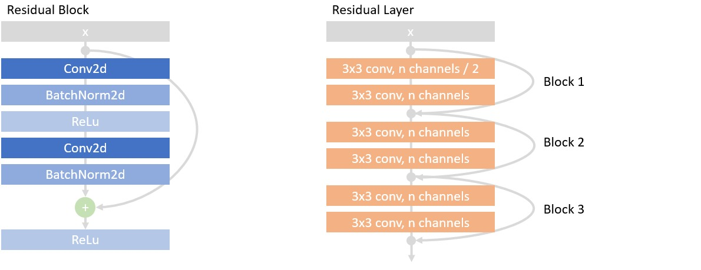
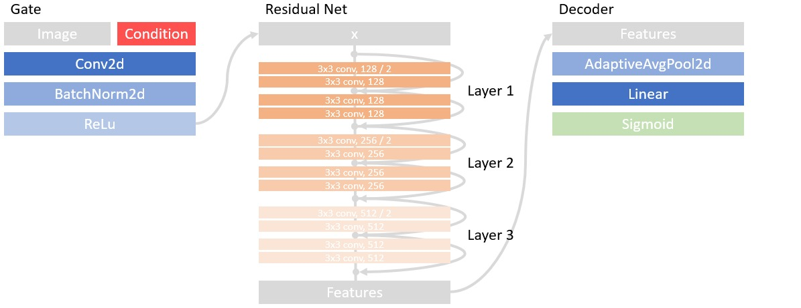
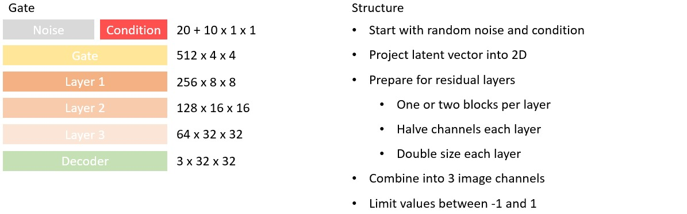

# PraktikumNN

Welcome to our project in which we try to generate images according to the [Cifar10](https://www.cs.toronto.edu/~kriz/cifar.html) data set by using different Conditional Generative Adversarial Nets. If you don't read this on GitHub we encourage you to have a look
at our [GitHub Repository](https://github.com/u-adrian/PraktikumNN).

## Explanation of the Nets we use
In this project we use 2 types of nets which can be found in the "Nets" directory. The first one is a simple implementation, while the second one includes residual connections.
The basic idea follows [Conditional Generative Adversarial Nets](https://arxiv.org/pdf/1411.1784.pdf).
### SmallGan
This architecture is influenced by the [Deep Convolutional GAN (DCGAN)](https://arxiv.org/abs/1511.06434).

#### Small Generator
We extended this version to incorporate a condition, representing the desired class label of the generated image.
The generator therefore receives a latent vector consisting of noise and condition. It uses a stack of transposed convolutions with batch norm and ReLU activations to create a 32 by 32 colored image.

#### The structure looks as follows:

#### Small Discriminator
The discriminator consists of a feature extractor and a linear classifier.
The feature extractor receives a 32 by 32 colored image and uses a stack of normal convolutions with batch norm and ReLU activations. The resulting features are given to the classifier together with the respective condition, which then outputs a value between 0 and 1.

#### The structure looks as follows:

### ResGan
This architecture is influenced by the [Deep Residual Net (ResNet)](https://arxiv.org/abs/1512.03385).

#### Residual Discriminator
We implemented a small modified ResNet as a discriminator and added the condition as one-hot-encoded feature maps to the 32 by 32 input image.
It uses residual blocks to form residual layers where each new layer performs downsampling (halve size, double channels).\

We use four layers with each one or alternatively two blocks per layer.
Together with a gate and a decoder, this constructs the discriminator.
#### Depth1

#### Depth 2

#### The final Residual Discriminator looks as follows

#### Residual Generator
For the generator we inverted this idea by defining a new transposed residual net.
It uses transposed convolutions instead of normal convolutions and upsampling (double size, halve channels) between layers instead of downsampling.

 Again, we use four layers with each one or alternatively two blocks per layer. Combined with a gate and a decoder, this constructs the generator.
#### Depth 1

#### Depth 2

#### The final Residual Generator looks as follows

### Auto Encoder
This architecture is only used for pretraining a generator network. It is not a conditional GAN itself.
Here we use a simple encoder to encode an image into a feature vector. A generator is trained to reconstruct the feature vector and respective condition to the original image.
As already said, this is not a network used to create images and only meant as an experiment to test if pretraining a generator in such a way affects the training of a full GAN.

## Current Results
We used the following configurations for our currently best working conditional GAN:
- generator = "res_net_depth1"
- discriminator = "res_net_depth1"
- criterion = "BCELoss"
- learning_rate = 0.0001
- real_img_fake_label = True
- num_epochs = 31
- noise_size = 20
- batch_size = 100
- weight_init = "normal"
- augmentation = False
- pretrained = False

We achieved following scores with this setup:
- inception score: 2.09
- frechet inception distance: 173.1

Here you can see some generated images:

#### Plane

#### Car

#### Bird

#### Cat

#### Deer

#### Dog

#### Frog

#### Horse

#### Ship

#### Truck

## Installation and Usage
To get this project running on your computer you first need to install conda.\
[Here](https://docs.anaconda.com/anaconda/install/index.html) you can find the installation guide for Anaconda. 
If you prefer Miniconda you can find an installation guide [here](https://docs.conda.io/en/latest/miniconda.html).

After installing conda you need to create a new environment from the environment.yaml file, 
which you can find in the main directory of this project.

The easiest way to do this is to open a command line in the main directory of the project and execute following command:\
`conda env create -f environment.yaml`\
This will create a new conda environment with the name "praktikum". To work on the new environment 
you need to activate it:\
`conda activate praktikum`\
Now you are able to run the code. To do so, you can execute one of the experiments defined in the "Experiments.py" file.\
An example:\
`python Experiments.py leaky_vs_normal_residual_discriminator`

Important information: the experiment "sig_opt_experiment(**kwargs)" cannot be executed in the
same manner used for the other experiments. It won't run on your local machine!

## Arguments for Trainer and Evaluator functions
In this paragraph we explain the arguments you can use for the Trainer and Evaluator functions.\
Some of them are self-explanatory, but some are not. And it is handy to have a list of all input arguments, therefore this paragraph.

- __batch_size__: Defines the size of a training batch.

- __noise_size__: Defines the size of the noise vector used for the generator.

- __num_epochs__: Defines the number of epochs the net is trained.

- __learning_rate__: Defines the learning rate. (We often used "0.0001")

- __criterion__: Defines the loss function. (Currently only "BCELoss" is implemented)

- __real_img_fake_label__: Defines whether the training function will additionally train the discriminator with real images but fake labels.
  - Possible Values:
    - False (Default)
    - True

- __pretraining__: Defines whether training function will use a pretrained generator or not. Path to pretrained model needs to be specified in __model_path__

- __augmentation__: Specifies if the algorithm uses data augmentation. 
       Right now only the random horizontal flip is used to augment the dataset.
  - Possible Values:
    - False (Default)
    - True

- __device__: Defines the device on which the model will be trained. (Default: "CPU")
  - Possible Values:
    - "CPU" (Default)
    - "GPU"

- __discriminator__: Defines the net used as discriminator for the model.\
  There is no default value and if you don't give a valid input, the code will throw an error.
  - Possible Values:
    - "small_gan"
    - "res_net_depth1"
    - "res_net_depth1_leaky"
    - "res_net_depth2"

- __generator__: Defines the used as generator for the model.\
  There is no default value and if you don't give a valid input, the code will throw an error.
  - Possible Values:
    - "small_gan"
    - "res_net_depth1"
    - "res_net_depth2"

- __weights_init__: Defines the method used for the weight initialization of the model.
  - Possible Values:
    - "normal" (Default)
    - "xavier"

- __model_path__: Defines the path to an existing model file. Or the path to the directory of multiple models. This depends on the function.

- __experiments_path__: Defines the path to a directory where the experiment results will be stored.

- __output_path__: Defines the path to a directory where the output (models/results) will be stored.

- __snapshot_interval__: Defines the number of epochs between saving a snapshot of the currently training model.

## Description of the Experiments
### Experiment 1: net_configuration
This experiments trains and evaluates different GAN architectures.
We test two core ideas:
First a simple and small architecture using only a few layers called SmallGan.
Second a more complicated structure based on residual connections called ResGan.
Here we use four layers and test one version with one block per layer and one version with two blocks per layer.

### Experiment 2: specialized_training:
This experiment trains and evaluates a GAN with and without special training on real images and false labels.
We test an addition to the training process of the discriminator.
Besides the normal training on real images with their labels and fake images with their labels, the addition includes training on real images with wrong labels.

### Experiment 3: leaky_vs_normal_residual_discriminator
This experiment trains and evaluates a GAN with leaky RelU and with normal ReLU as activation in the Discriminator.
We test the impact of the activation function used in the discriminator.
Take note that we only test this for the ResGan architecture.

### Experiment 4: xavier_vs_normal_init
This experiment trains and evaluates a GAN with xavier and with normal weight initialization.
We test the impact of the weight initialization for the generator and the discriminator.

### Experiment 5: data_augmentation
This experiment trains and evaluates a GAN with and without augmentation of the training data.
We test the impact of data augmentation for the training results.

### Experiment 6: generator_pretraining
This experiment trains and evaluates a GAN with and without pretraining of the training generator.
We test the impact of pretraining the generator as an autoencoder for the training results.

### Experiment X: sig_opt_experiment
This Experiment is an attempt to find the best GAN, that our code could produce in a 
reasonable timespan. Meant to be run on the BwUniCluster. 
To accomplish our goal we use the code from the repository "cluster-hyperopt" developed by "aimat-lab", 
a tool called [SigOpt](https://sigopt.com/) and the [BwUniCluster](https://wiki.bwhpc.de/e/Category:BwUniCluster_2.0).
Sadly I can't provide a link to the "aimat-lab/cluster-hyperopt" repository, since this project isn't public yet.
SigOpt is a tool for hyperparameter optimization.

What "cluster-hyperopt" does:
1) getting hyper-parameter suggestions from SigOpt
2) training and evaluating the model with the suggested parameters
3) sending the scores to SigOpt and start at 1) again

In our case this loop will be repeated 30 times.

